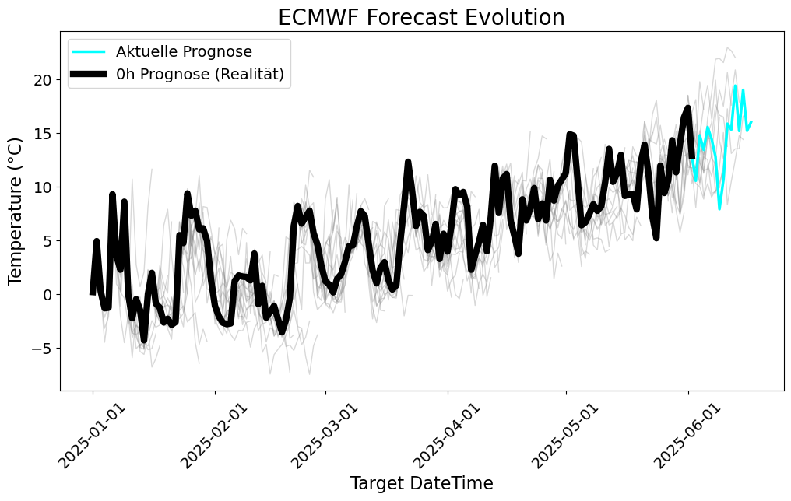
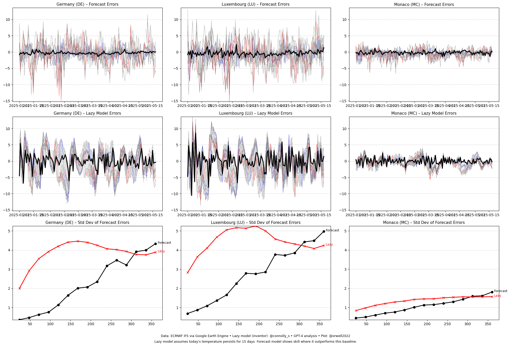

```python
import ee
import datetime
import pandas as pd

try:
    ee.Initialize()
except Exception as e:
    print(f"Failed to initialize Earth Engine: {e}")
    try:
        ee.Authenticate()
        ee.Initialize()
    except Exception as e_auth:
        print(f"Authentication and re-initialization failed: {e_auth}")
        print("Please ensure you have authenticated (earthengine authenticate) and have a valid GEE account setup with a GCloud project.")
        exit()

# --- Configuration ---
START_CREATION_DATE_STR = '2025-05-31'
END_CREATION_DATE_STR = '2025-06-04'

FORECAST_RUN_TIME_OF_DAY_UTC = 'T00:00:00Z'
OUTPUT_FILENAME = "forecast_germany_pivoted_celsius_24h_steps_0406.tsv" # Reflects Celsius

# Define Germany geometry
germany_geom_py = ee.FeatureCollection('WM/geoLab/geoBoundaries/600/ADM0') \
                   .filter(ee.Filter.eq('shapeName', 'Germany')) \
                   .first() \
                   .geometry()
print("Germany geometry defined.")

# --- Main Logic ---
all_forecast_data_for_df = []
creation_dates_to_process = []

current_date_dt = datetime.datetime.strptime(START_CREATION_DATE_STR, '%Y-%m-%d')
end_date_dt = datetime.datetime.strptime(END_CREATION_DATE_STR, '%Y-%m-%d')
while current_date_dt <= end_date_dt:
    creation_dates_to_process.append(current_date_dt.strftime('%Y-%m-%d'))
    current_date_dt += datetime.timedelta(days=1)

if not creation_dates_to_process:
    print("No creation dates to process. Check START and END creation dates.")
    exit()

print(f"Processing {len(creation_dates_to_process)} creation dates from {START_CREATION_DATE_STR} to {END_CREATION_DATE_STR} for Germany.")
print("Fetching data in 24-hour forecast steps. Temperatures are assumed to be in Celsius as observed.")
print("-" * 60)
print(f"{'Creation Date':<15} | {'Fcst Hour':<10} | {'Mean Temp DE (°C)':<20} |") # Clearly °C
print("-" * 60)


for creation_date_str in creation_dates_to_process:
    # print(f"\nProcessing Forecast Run Created On: {creation_date_str}") # Optional

    forecast_creation_datetime_ee = ee.Date(creation_date_str + FORECAST_RUN_TIME_OF_DAY_UTC)
    creation_time_millis_ee = forecast_creation_datetime_ee.millis()

    forecast_run_collection = ee.ImageCollection('ECMWF/NRT_FORECAST/IFS/OPER') \
        .filter(ee.Filter.eq('creation_time', creation_time_millis_ee)) \
        .select('temperature_2m_sfc')

    try:
        available_fcst_hours_ee = forecast_run_collection.aggregate_array('forecast_hours').sort()
        all_available_hours_py = available_fcst_hours_ee.getInfo()

        if not all_available_hours_py:
            print(f"  No forecast hours found for creation date {creation_date_str}.")
            continue
        
        forecast_hours_to_process_py = [h for h in all_available_hours_py if h % 24 == 0]
        if 0 not in forecast_hours_to_process_py and 0 in all_available_hours_py:
            forecast_hours_to_process_py.insert(0,0)
            forecast_hours_to_process_py.sort()

        if not forecast_hours_to_process_py:
            print(f"  No 24-hour step forecast hours found for {creation_date_str}.")
            continue
        # print(f"  Processing {len(forecast_hours_to_process_py)} forecast steps: {forecast_hours_to_process_py}")

    except ee.EEException as e:
        print(f"  GEE Error getting available forecast hours for {creation_date_str}: {e}")
        continue

    for fcst_hour_py in forecast_hours_to_process_py:
        try:
            image_for_hour_ee = forecast_run_collection \
                .filter(ee.Filter.eq('forecast_hours', fcst_hour_py)) \
                .first()

            mean_temp_obj_ee = ee.Algorithms.If(
                image_for_hour_ee,
                ee.Image(image_for_hour_ee).reduceRegion(
                    reducer=ee.Reducer.mean(),
                    geometry=germany_geom_py,
                    scale=10000,
                    maxPixels=1e9,
                    tileScale=4
                ).get('temperature_2m_sfc'),
                None
            )

            # Get the temperature value as is from GEE (assumed to be Celsius by user observation)
            mean_temp_celsius_py = mean_temp_obj_ee.getInfo()

            # Print immediately
            temp_c_str = f"{mean_temp_celsius_py:.2f}" if mean_temp_celsius_py is not None else "N/A"
            print(f"{creation_date_str:<15} | {fcst_hour_py:<10} | {temp_c_str:<20} |")

            # Store the temperature value for the DataFrame
            all_forecast_data_for_df.append({
                'CreationDate': creation_date_str,
                'ForecastHour': fcst_hour_py, # Store as number
                'MeanTemp_C': mean_temp_celsius_py # Store as Celsius
            })

        except ee.EEException as e:
            print(f"{creation_date_str:<15} | {fcst_hour_py:<10} | {'GEE Error':<20} | Details: {e}")
        except Exception as e_generic:
            print(f"{creation_date_str:<15} | {fcst_hour_py:<10} | {'Py Error':<20} | Details: {e_generic}")


# --- Convert to Pandas DataFrame, Pivot, Print, and Write to TSV File ---
if not all_forecast_data_for_df:
    print("\nNo data collected to create the table.")
else:
    print("\nData collection complete. Creating final pivoted table for file...")
    df = pd.DataFrame(all_forecast_data_for_df)

    try:
        pivot_df = df.pivot_table(
            index=['CreationDate'],
            columns='ForecastHour', # Uses numeric hour for columns
            values='MeanTemp_C'    # Values are Celsius
        )
        
        if not pivot_df.empty:
            try:
                # Columns should already be numeric and thus sortable if pandas does it by default
                # If not, this ensures numerical order
                column_hours_numeric = sorted([int(col) for col in pivot_df.columns])
                pivot_df = pivot_df[column_hours_numeric] # Reorder if necessary
            except ValueError:
                print("    Warning: Could not numerically sort forecast hour columns for file output.")
            
            print("\n--- Forecast Temperatures for Germany (°C) ---")
            # print(pivot_df.to_string(max_rows=20)) # Optional: print full pivot to console
            print("(Pivoted table will be written to file)")


            pivot_df.to_csv(OUTPUT_FILENAME, sep='\t', na_rep='NaN', float_format='%.2f')
            print(f"\nPivoted table successfully written to {OUTPUT_FILENAME}")
        else:
            print("Pivot table is empty after attempting pivot.")

    except Exception as e_pivot:
        print(f"Error during pivoting or writing DataFrame: {e_pivot}")
        print("Collected data (first 10 rows):")
        for i, row_data in enumerate(all_forecast_data_for_df):
            if i >= 10: break
            print(row_data)

print("\nScript finished.")
```

    Germany geometry defined.
    Processing 5 creation dates from 2025-05-31 to 2025-06-04 for Germany.
    Fetching data in 24-hour forecast steps. Temperatures are assumed to be in Celsius as observed.
    ------------------------------------------------------------
    Creation Date   | Fcst Hour  | Mean Temp DE (°C)    |
    ------------------------------------------------------------
    2025-05-31      | 0          | 14.52                |
    2025-05-31      | 24         | 15.73                |
    2025-05-31      | 48         | 14.07                |
    2025-05-31      | 72         | 11.18                |
    2025-05-31      | 96         | 14.08                |
    2025-05-31      | 120        | 14.31                |
    2025-05-31      | 144        | 15.84                |
    2025-05-31      | 168        | 13.66                |
    2025-05-31      | 192        | 9.96                 |
    2025-05-31      | 216        | 11.44                |
    2025-05-31      | 240        | 16.13                |
    2025-05-31      | 264        | 10.08                |
    2025-05-31      | 288        | 9.05                 |
    2025-05-31      | 312        | 9.38                 |
    2025-05-31      | 336        | 11.93                |
    2025-05-31      | 360        | 11.40                |
    2025-06-01      | 0          | 16.17                |
    2025-06-01      | 24         | 14.06                |
    2025-06-01      | 48         | 11.52                |
    2025-06-01      | 72         | 14.77                |
    2025-06-01      | 96         | 13.96                |
    2025-06-01      | 120        | 14.61                |
    2025-06-01      | 144        | 16.11                |
    2025-06-01      | 168        | 13.28                |
    2025-06-01      | 192        | 9.78                 |
    2025-06-01      | 216        | 12.47                |
    2025-06-01      | 240        | 16.61                |
    2025-06-01      | 264        | 14.62                |
    2025-06-01      | 288        | 13.27                |
    2025-06-01      | 312        | 11.09                |
    2025-06-01      | 336        | 15.15                |
    2025-06-01      | 360        | 13.57                |
    2025-06-02      | 0          | 14.16                |
    2025-06-02      | 24         | 11.73                |
    2025-06-02      | 48         | 14.56                |
    2025-06-02      | 72         | 14.77                |
    2025-06-02      | 96         | 13.73                |
    2025-06-02      | 120        | 14.86                |
    2025-06-02      | 144        | 13.90                |
    2025-06-02      | 168        | 9.66                 |
    2025-06-02      | 192        | 10.65                |
    2025-06-02      | 216        | 14.76                |
    2025-06-02      | 240        | 14.10                |
    2025-06-02      | 264        | 17.63                |
    2025-06-02      | 288        | 16.11                |
    2025-06-02      | 312        | 18.56                |
    2025-06-02      | 336        | 15.35                |
    2025-06-02      | 360        | 14.52                |
    2025-06-03      | 0          | 11.87                |
    2025-06-03      | 24         | 15.10                |
    2025-06-03      | 48         | 13.70                |
    2025-06-03      | 72         | 13.09                |
    2025-06-03      | 96         | 14.29                |
    2025-06-03      | 120        | 13.82                |
    2025-06-03      | 144        | 9.62                 |
    2025-06-03      | 168        | 9.79                 |
    2025-06-03      | 192        | 13.21                |
    2025-06-03      | 216        | 14.11                |
    2025-06-03      | 240        | 17.75                |
    2025-06-03      | 264        | 17.45                |
    2025-06-03      | 288        | 14.49                |
    2025-06-03      | 312        | 13.07                |
    2025-06-03      | 336        | 14.18                |
    2025-06-03      | 360        | 14.05                |
    2025-06-04      | 24         | 13.95                |
    2025-06-04      | 48         | 13.92                |
    2025-06-04      | 96         | 14.05                |
    
    Data collection complete. Creating final pivoted table for file...
    
    --- Forecast Temperatures for Germany (°C) ---
    (Pivoted table will be written to file)
    
    Pivoted table successfully written to forecast_germany_pivoted_celsius_24h_steps_0406.tsv
    
    Script finished.
    


```python
import pandas as pd
import matplotlib
matplotlib.use('Agg')  # Use non-interactive backend for file saving
import matplotlib.pyplot as plt
import matplotlib.dates as mdates
import matplotlib.animation as animation
from datetime import timedelta

# File path to the uploaded TSV
#file_path = 'forecast_germany_pivoted_celsius_24h_steps.tsv'
file_path = 'country_forecast_data/forecast_LU_pivoted_celsius_24h_steps.tsv'

# Read the TSV file
df = pd.read_csv(file_path, sep='\t', index_col=0, engine='python')

# Convert index (creation dates) to datetime
df.index = pd.to_datetime(df.index)

# Sort columns by forecast hour (in case they are not sorted)
forecast_hours = sorted([int(col) for col in df.columns])
df = df[[str(hour) for hour in forecast_hours]]

# Select the last 30 creation dates
df_last30 = df
creation_dates = df_last30.index.tolist()

# Prepare forecast data: for each creation date, compute target datetimes and values
forecasts = []
for creation in creation_dates:
    row = df_last30.loc[creation]
    x = [creation + timedelta(hours=hour) for hour in forecast_hours]
    y = row.values.tolist()
    truth = row[str(0)]  # 0-hour forecast value
    forecasts.append({'creation': creation, 'x': x, 'y': y, 'truth': truth})

# Prepare figure and axis
fig, ax = plt.subplots(figsize=(12, 6))

# Animation function
def animate(i):
    ax.clear()
    
    # Plot previous forecasts as thin gray lines
    for j in range(i):
        ax.plot(forecasts[j]['x'], forecasts[j]['y'], color='gray', linewidth=1, alpha=0.3)
    
    # Plot current forecast in cyan
    current_line, = ax.plot(
        forecasts[i]['x'],
        forecasts[i]['y'],
        color='cyan',
        linewidth=2.5,
        label='Aktuelle Prognose'
    )
    
    # Plot the "truth" line connecting 0h forecasts up to current frame
    truth_x = [forecasts[k]['creation'] for k in range(i + 1)]
    truth_y = [forecasts[k]['truth'] for k in range(i + 1)]
    truth_line, = ax.plot(
        truth_x,
        truth_y,
        color='black',
        linewidth=6,
        label='0h Prognose (Realität)'
    )
    
    # Reapply formatting
    ax.xaxis.set_major_formatter(mdates.DateFormatter('%Y-%m-%d'))
    ax.xaxis.set_major_locator(mdates.AutoDateLocator())
    plt.xticks(rotation=45, fontsize=14)
    plt.yticks(fontsize=14)
    ax.set_xlabel('Target DateTime', fontsize=16)
    ax.set_ylabel('Temperature (°C)', fontsize=16)
    ax.set_title('ECMWF Forecast Evolution', fontsize=20)
    
    # Add legend with only current and truth lines
    ax.legend(handles=[current_line, truth_line], fontsize=14)

# Create the animation
anim = animation.FuncAnimation(
    fig,
    animate,
    frames=len(forecasts),
    interval=200
)

# Save animation as MP4
output_path = 'ecmwf_forecast_last30days.gif'
try:
    anim.save(output_path, writer='gig', dpi=200)
    print("Animation saved successfully.")
except Exception as e:
    print(f"Warning: ffmpeg not available or an error occurred: {e}. Skipping saving.")

```

    MovieWriter gig unavailable; using Pillow instead.
    

    Animation saved successfully.
    


```python
import ee
import datetime
import pandas as pd
import os # For creating directory if it doesn't exist

try:
    ee.Initialize()
except Exception as e:
    print(f"Failed to initialize Earth Engine: {e}")
    try:
        ee.Authenticate()
        ee.Initialize()
    except Exception as e_auth:
        print(f"Authentication and re-initialization failed: {e_auth}")
        print("Please ensure you have authenticated (earthengine authenticate) and have a valid GEE account setup with a GCloud project.")
        exit()

# --- Configuration ---
START_CREATION_DATE_STR = '2025-01-01'
END_CREATION_DATE_STR = '2025-06-02'   # Keep it short for testing multiple countries

FORECAST_RUN_TIME_OF_DAY_UTC = 'T00:00:00Z'
OUTPUT_DIRECTORY = "country_forecast_data" # Directory to save files

# Define countries to process: Short Label for filename, GEE shapeName
COUNTRIES_TO_PROCESS = {
    "LU": "Luxembourg",
    "MC": "Monaco"
}

# Create output directory if it doesn't exist
if not os.path.exists(OUTPUT_DIRECTORY):
    os.makedirs(OUTPUT_DIRECTORY)
    print(f"Created output directory: {OUTPUT_DIRECTORY}")


# --- Main Loop for Each Country ---
for country_code, country_name in COUNTRIES_TO_PROCESS.items():
    print(f"\n======================================================================")
    print(f"Processing for Country: {country_name} (Code: {country_code})")
    print(f"======================================================================")

    output_filename = os.path.join(OUTPUT_DIRECTORY, f"forecast_{country_code}_pivoted_celsius_24h_steps.tsv")

    # Define country geometry for the current country
    try:
        country_geom_py = ee.FeatureCollection('WM/geoLab/geoBoundaries/600/ADM0') \
                           .filter(ee.Filter.eq('shapeName', country_name)) \
                           .first() \
                           .geometry()
        # Check if geometry was found
        geom_info = country_geom_py.getInfo() # This call will error if geometry is null
        if geom_info is None or 'type' not in geom_info :
             print(f"Could not define geometry for {country_name}. Skipping.")
             continue
        print(f"{country_name} geometry defined.")
    except Exception as e_geom:
        print(f"Error defining geometry for {country_name}: {e_geom}. Skipping this country.")
        continue


    all_forecast_data_for_df = [] # Reset for each country
    creation_dates_to_process = []

    current_date_dt = datetime.datetime.strptime(START_CREATION_DATE_STR, '%Y-%m-%d')
    end_date_dt = datetime.datetime.strptime(END_CREATION_DATE_STR, '%Y-%m-%d')
    while current_date_dt <= end_date_dt:
        creation_dates_to_process.append(current_date_dt.strftime('%Y-%m-%d'))
        current_date_dt += datetime.timedelta(days=1)

    if not creation_dates_to_process:
        print(f"  No creation dates to process for {country_name}. Check START and END creation dates.")
        continue # Should not happen if script start is guarded

    print(f"  Processing {len(creation_dates_to_process)} creation dates from {START_CREATION_DATE_STR} to {END_CREATION_DATE_STR} for {country_name}.")
    print(f"  Fetching data in 24-hour forecast steps. Temperatures are assumed to be in Celsius.")
    print("-" * 70)
    print(f"{'Creation Date':<15} | {'Fcst Hour':<10} | {'Mean Temp '+country_code+' (°C)':<20} |")
    print("-" * 70)

    for creation_date_str in creation_dates_to_process:
        forecast_creation_datetime_ee = ee.Date(creation_date_str + FORECAST_RUN_TIME_OF_DAY_UTC)
        creation_time_millis_ee = forecast_creation_datetime_ee.millis()

        forecast_run_collection = ee.ImageCollection('ECMWF/NRT_FORECAST/IFS/OPER') \
            .filter(ee.Filter.eq('creation_time', creation_time_millis_ee)) \
            .select('temperature_2m_sfc')

        try:
            available_fcst_hours_ee = forecast_run_collection.aggregate_array('forecast_hours').sort()
            all_available_hours_py = available_fcst_hours_ee.getInfo()

            if not all_available_hours_py:
                print(f"    No forecast hours found for {creation_date_str} for {country_name}.")
                continue
            
            forecast_hours_to_process_py = [h for h in all_available_hours_py if h % 24 == 0]
            if 0 not in forecast_hours_to_process_py and 0 in all_available_hours_py:
                forecast_hours_to_process_py.insert(0,0)
                forecast_hours_to_process_py.sort()

            if not forecast_hours_to_process_py:
                print(f"    No 24-hour step forecast hours found for {creation_date_str} for {country_name}.")
                continue
        except ee.EEException as e:
            print(f"    GEE Error getting available forecast hours for {creation_date_str} ({country_name}): {e}")
            continue

        for fcst_hour_py in forecast_hours_to_process_py:
            try:
                image_for_hour_ee = forecast_run_collection \
                    .filter(ee.Filter.eq('forecast_hours', fcst_hour_py)) \
                    .first()

                mean_temp_obj_ee = ee.Algorithms.If(
                    image_for_hour_ee,
                    ee.Image(image_for_hour_ee).reduceRegion(
                        reducer=ee.Reducer.mean(),
                        geometry=country_geom_py, # Use current country's geometry
                        scale=10000, # Consider adjusting for very small countries like Monaco
                        maxPixels=1e9, # May need to adjust for very large countries if issues arise
                        tileScale=4    # May need to adjust
                    ).get('temperature_2m_sfc'),
                    None
                )
                mean_temp_celsius_py = mean_temp_obj_ee.getInfo()

                temp_c_str = f"{mean_temp_celsius_py:.2f}" if mean_temp_celsius_py is not None else "N/A"
                print(f"{creation_date_str:<15} | {fcst_hour_py:<10} | {temp_c_str:<20} |")

                all_forecast_data_for_df.append({
                    'CreationDate': creation_date_str,
                    'ForecastHour': fcst_hour_py,
                    'MeanTemp_C': mean_temp_celsius_py
                })
            except ee.EEException as e:
                print(f"{creation_date_str:<15} | {fcst_hour_py:<10} | {'GEE Error':<20} | {country_name}: {e}")
            except Exception as e_generic:
                print(f"{creation_date_str:<15} | {fcst_hour_py:<10} | {'Py Error':<20} | {country_name}: {e_generic}")

    # --- Convert to Pandas DataFrame, Pivot, Print, and Write to TSV File FOR CURRENT COUNTRY ---
    if not all_forecast_data_for_df:
        print(f"\nNo data collected for {country_name} to create the table.")
    else:
        print(f"\nData collection complete for {country_name}. Creating final pivoted table for file...")
        df = pd.DataFrame(all_forecast_data_for_df)
        try:
            pivot_df = df.pivot_table(
                index=['CreationDate'],
                columns='ForecastHour',
                values='MeanTemp_C'
            )
            if not pivot_df.empty:
                try:
                    column_hours_numeric = sorted([int(col) for col in pivot_df.columns])
                    pivot_df = pivot_df[column_hours_numeric]
                except ValueError:
                    print(f"    Warning: Could not numerically sort forecast hour columns for {country_name} file output.")
                
                console_title = f"\n--- Forecast Temperatures for {country_name} (°C) ---"
                print(console_title)
                # print(pivot_df.to_string(max_rows=10)) # Optional console print
                print(f"(Pivoted table for {country_name} will be written to {output_filename})")

                pivot_df.to_csv(output_filename, sep='\t', na_rep='NaN', float_format='%.2f')
                print(f"\nPivoted table for {country_name} successfully written to {output_filename}")
            else:
                print(f"Pivot table is empty for {country_name} after attempting pivot.")
        except Exception as e_pivot:
            print(f"Error during pivoting or writing DataFrame for {country_name}: {e_pivot}")

print("\nAll specified countries processed. Script finished.")
```


```python
%matplotlib inline
import pandas as pd
import matplotlib.pyplot as plt

# Load datasets (change paths if needed)
df_de = pd.read_csv("forecast_germany_pivoted_celsius_24h_steps.tsv", sep="\t")
df_lu = pd.read_csv("country_forecast_data/forecast_LU_pivoted_celsius_24h_steps.tsv", sep="\t")
df_mc = pd.read_csv("country_forecast_data/forecast_MC_pivoted_celsius_24h_steps.tsv", sep="\t")

# Convert dates
for df in [df_de, df_lu, df_mc]:
    df["CreationDate"] = pd.to_datetime(df["CreationDate"])

# Forecast error function
def compute_forecast_errors(df):
    future_obs = df[["CreationDate", "0"]].copy()
    future_obs.columns = ["TargetDate", "Actual_0h"]
    forecast_errors = df[["CreationDate"]].copy()
    for h in range(24, 361, 24):
        df[f"TargetDate_{h}h"] = df["CreationDate"] + pd.to_timedelta(h, unit='h')
        merged = pd.merge(df, future_obs, left_on=f"TargetDate_{h}h", right_on="TargetDate", how="left")
        forecast_errors[f"Error_{h}h"] = merged[str(h)] - merged["Actual_0h"]
    return forecast_errors.set_index("CreationDate")

# Lazy model error function
def compute_lazy_errors(df):
    lazy = df[["CreationDate", "0"]].copy()
    for h in range(24, 361, 24):
        lazy[str(h)] = lazy["0"]
        lazy[f"TargetDate_{h}h"] = lazy["CreationDate"] + pd.to_timedelta(h, unit='h')
    future_obs = df[["CreationDate", "0"]].copy()
    future_obs.columns = ["TargetDate", "Actual_0h"]
    lazy_errors = lazy[["CreationDate"]].copy()
    for h in range(24, 361, 24):
        merged = pd.merge(lazy, future_obs, left_on=f"TargetDate_{h}h", right_on="TargetDate", how="left")
        lazy_errors[f"Error_{h}h"] = merged[str(h)] - merged["Actual_0h"]
    return lazy_errors.set_index("CreationDate")

# Compute errors
errors_de = compute_forecast_errors(df_de)
errors_lu = compute_forecast_errors(df_lu)
errors_mc = compute_forecast_errors(df_mc)
lazy_de = compute_lazy_errors(df_de)
lazy_lu = compute_lazy_errors(df_lu)
lazy_mc = compute_lazy_errors(df_mc)

# Trim to 15 days before end
latest = df_de["CreationDate"].max() - pd.Timedelta(days=15)
datasets_forecast = [errors_de[errors_de.index <= latest], errors_lu[errors_lu.index <= latest], errors_mc[errors_mc.index <= latest]]
datasets_lazy = [lazy_de[lazy_de.index <= latest], lazy_lu[lazy_lu.index <= latest], lazy_mc[lazy_mc.index <= latest]]

# Std devs
std_sets = [(errors_de.std(), lazy_de.std()),
            (errors_lu.std(), lazy_lu.std()),
            (errors_mc.std(), lazy_mc.std())]
labels = ["Germany (DE)", "Luxembourg (LU)", "Monaco (MC)"]
hours = list(range(24, 361, 24))

# Y-axis range
def compute_ylim(*dfs):
    all_vals = pd.concat(dfs, axis=0).values.flatten()
    return all_vals[~pd.isnull(all_vals)].min(), all_vals[~pd.isnull(all_vals)].max()

error_ylim = compute_ylim(*datasets_forecast, *datasets_lazy)
std_ylim = compute_ylim(*[x[0] for x in std_sets], *[x[1] for x in std_sets])

# Plot 3x3 layout
fig, axes = plt.subplots(3, 3, figsize=(20, 14))

for i in range(3):
    # Forecast error time series
    for h in hours:
        color = 'gray'
        if h == 144: color = 'blue'
        if h == 312: color = 'red'
        if h != 24:
            axes[0, i].plot(datasets_forecast[i].index, datasets_forecast[i][f"Error_{h}h"], color=color, alpha=0.6, linewidth=0.8)
    axes[0, i].plot(datasets_forecast[i].index, datasets_forecast[i]["Error_24h"], color='black', linewidth=2.5)
    axes[0, i].set_title(f"{labels[i]} – Forecast Errors", fontsize=11)
    axes[0, i].set_ylim(error_ylim)
    axes[0, i].grid(axis='y', linestyle='--', linewidth=0.5)

    # Lazy model error time series
    for h in hours:
        color = 'gray'
        if h == 144: color = 'blue'
        if h == 312: color = 'red'
        if h != 24:
            axes[1, i].plot(datasets_lazy[i].index, datasets_lazy[i][f"Error_{h}h"], color=color, alpha=0.6, linewidth=0.8)
    axes[1, i].plot(datasets_lazy[i].index, datasets_lazy[i]["Error_24h"], color='black', linewidth=2.5)
    axes[1, i].set_title(f"{labels[i]} – Lazy Model Errors", fontsize=11)
    axes[1, i].set_ylim(error_ylim)
    axes[1, i].grid(axis='y', linestyle='--', linewidth=0.5)

    # Std dev plot
    model_std, lazy_std = std_sets[i]
    axes[2, i].plot(hours, model_std.values, color='black', linewidth=2, marker='o')
    axes[2, i].plot(hours, lazy_std.values, color='red', linewidth=2, marker='x')
    axes[2, i].set_title(f"{labels[i]} – Std Dev of Forecast Errors", fontsize=11)
    axes[2, i].set_ylim(std_ylim)
    axes[2, i].grid(axis='y', linestyle='--', linewidth=0.5)
    axes[2, i].text(hours[-1] + 5, model_std.values[-1], "Forecast", color='black', fontsize=9)
    axes[2, i].text(hours[-1] + 5, lazy_std.values[-1], "Lazy", color='red', fontsize=9)

# Footnotes
fig.text(0.5, 0.018,
         "Data: ECMWF IFS via Google Earth Engine • Lazy model (inventor): @connolly_s • GPT-4 analysis • Plot: @orwell2022",
         ha='center', va='bottom', fontsize=9)
fig.text(0.5, 0.002,
         "Lazy model assumes today's temperature persists for 15 days. Forecast model shows skill where it outperforms this baseline.",
         ha='center', va='bottom', fontsize=9)

plt.tight_layout(rect=[0, 0.04, 1, 0.96])
plt.show()

```


    

    


    

    


    


ECMWF Forecast Data Processing and Error Analysis
This set of Python scripts retrieves, processes, and visualizes ECMWF 2-meter temperature forecasts for multiple countries using Google Earth Engine (GEE), analyzes forecast errors, and compares them to a baseline "lazy" model. The scripts focus on mean temperature forecasts but can be extended to include standard deviation (ensemble spread) data as described in query_stdev.md.
Overview
The scripts perform the following tasks:
Data Retrieval: Query ECMWF IFS operational forecast data (ECMWF/NRT_FORECAST/IFS/OPER) for 2-meter temperatures at 24-hour intervals (0h to 360h) over specified date ranges and geographic regions (e.g., Germany, Luxembourg, Monaco).

Data Processing: Compute regional mean temperatures for each country, pivot the data into tables, and save them as TSV files.

Visualization: Generate an animated GIF showing forecast evolution and a 3x3 plot grid comparing forecast errors and their standard deviations against a lazy model (persistence forecast).

Error Analysis: Calculate forecast errors (ECMWF forecast minus actual 0h temperature) and lazy model errors, with standard deviations to assess forecast performance.

Scripts and Functionality
1. Single-Country Forecast Retrieval (first_script.py)
Purpose: Retrieves 2-meter temperature forecasts for Germany over a short date range (e.g., May 31, 2025, to June 4, 2025).

Workflow:
Defines Germany’s geometry using the geoBoundaries dataset (WM/geoLab/geoBoundaries/600/ADM0).

Queries GEE for ECMWF forecasts at 00:00 UTC for each creation date, selecting temperature_2m_sfc.

Computes mean temperatures over Germany for 24-hour forecast steps (0h, 24h, ..., 360h).

Pivots data into a table (rows: creation dates, columns: forecast hours) and saves it as a TSV file (forecast_germany_pivoted_celsius_24h_steps_0406.tsv).

Output: Console table of mean temperatures (°C) and a TSV file.

2. Forecast Evolution Animation (second_script.py)
Purpose: Visualizes the evolution of temperature forecasts for Luxembourg as an animated GIF.

Workflow:
Loads the TSV file for Luxembourg (forecast_LU_pivoted_celsius_24h_steps.tsv).

For each creation date, plots the forecast temperatures (cyan line) and actual 0h temperatures (black line) over target datetimes, with previous forecasts in gray.

Saves the animation as ecmwf_forecast_last30days.gif using the Pillow writer.

Output: A GIF showing how forecasts converge to actual temperatures over time.

3. Multi-Country Forecast Retrieval (third_script.py)
Purpose: Extends the first script to process forecasts for multiple countries (Luxembourg, Monaco) over a longer period (e.g., Jan 1, 2025, to June 2, 2025).

Workflow:
Loops through a dictionary of countries (LU: Luxembourg, MC: Monaco).

For each country:
Defines geometry using geoBoundaries.

Queries ECMWF data and computes mean temperatures.

Saves pivoted tables to TSV files in the country_forecast_data directory (e.g., forecast_LU_pivoted_celsius_24h_steps.tsv).

Output: TSV files for each country with mean temperatures.

4. Forecast Error Analysis and Visualization (fourth_script.py)
Purpose: Analyzes forecast errors for Germany, Luxembourg, and Monaco, comparing ECMWF forecasts to a lazy model (persistence).

Workflow:
Loads TSV files for each country.

Computes forecast errors: Predicted temperature (24h to 360h) minus actual 0h temperature at the target date.

Computes lazy model errors: Assumes the 0h temperature persists for all forecast horizons.

Trims data to the last 15 days before the latest creation date.

Creates a 3x3 plot grid:
Row 1: Time series of forecast errors (24h in black, 144h in blue, 312h in red, others in gray).

Row 2: Time series of lazy model errors.

Row 3: Standard deviation of errors for ECMWF (black) vs. lazy model (red) across forecast hours.

Output: Three PNG plots showing error time series and standard deviations for each country.

Relation to query_stdev.md
The query_stdev.md file likely describes how to query ECMWF ensemble spread (standard deviation) data, which quantifies forecast uncertainty across ensemble members. While the provided scripts focus on mean temperatures, the fourth script computes the standard deviation of forecast errors over creation dates, indirectly assessing forecast uncertainty. To directly incorporate ensemble spread:
Modify the data retrieval scripts to query the temperature_2m_sfc_spread band (if available in GEE) or use ECMWF’s CDS API to fetch ensemble spread data.

Add standard deviation to the TSV files and visualize it (e.g., as error bars or shaded regions) in the plots.

Key Features
Data Source: ECMWF IFS operational forecasts via GEE.

Countries: Germany, Luxembourg, Monaco (extensible to others).

Forecast Horizons: 0h to 360h at 24-hour intervals.

Error Analysis: Compares ECMWF forecasts to a lazy model, with standard deviation as a performance metric.

Visualizations: Animated GIF for forecast evolution and 3x3 plot grid for error analysis.

Dependencies
Python libraries: ee (Google Earth Engine), pandas, matplotlib, matplotlib.animation.

GEE account with authentication.

ECMWF data access via GEE (requires ECMWF/NRT_FORECAST/IFS/OPER dataset).

Outputs
TSV Files: Pivoted tables with mean temperatures for each country (forecast_[COUNTRY]_pivoted_celsius_24h_steps.tsv).

GIF: Animated visualization of forecast evolution (ecmwf_forecast_last30days.gif).

PNG Plots: 3x3 grid comparing forecast and lazy model errors and their standard deviations.

Usage Notes
Adjust the scale parameter in GEE queries for small countries (e.g., Monaco) to avoid over-averaging.

Extend the scripts to include ensemble spread data for direct uncertainty analysis (see query_stdev.md).

Optimize GEE queries for large date ranges by caching results or using batch processing.

Credits
Data: ECMWF IFS via Google Earth Engine.

Lazy Model Concept: @connolly_s
.

Analysis: GPT-4.

Plotting: @orwell2022
.


